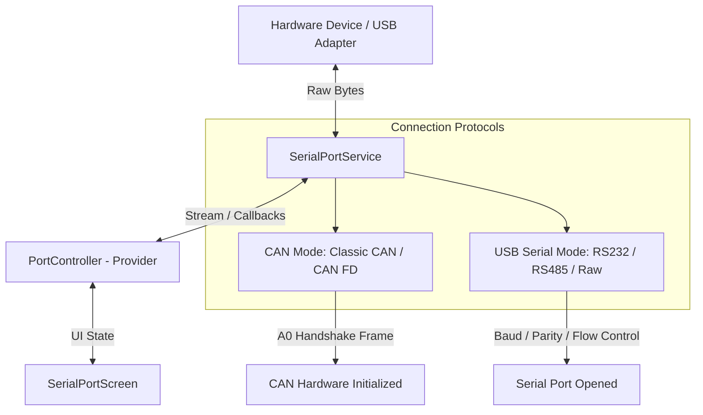

# Frontend Serial & CAN Monitor - Cloned Project Specification

## 1. Executive Summary

This document outlines the design, architecture, and feature specification for cloning the **Serial & CAN Monitor** project into a streamlined, standalone desktop application. 

The cloned project focuses exclusively on **Frontend UI & Native Serial/CAN Communication capabilities**, omitting all backend server dependencies and specialized manufacturing/calibration utilities.

---

## 2. Architectural Scope

### Included Architecture
* **Frontend Framework**: Flutter Desktop (Windows target, cross-platform capable).
* **Execution Mode**: 100% Offline & Standalone — Native serial communication executed directly within Dart via `flutter_libserialport`.
* **Hardware Support**: USB Serial (RS232/RS485/UART) and CAN Bus adapters (Classic CAN & CAN FD).

### Explicit Exclusions
1. **Backend Server**: No Express/Node.js backend required (`BACKEND/` directory is excluded completely).
2. **Bulk OTA Update**: Omitted (`bulk_firmware_service.dart`, `bulk_firmware_dialog.dart`).
3. **Device Calibration**: Omitted (`calibration_dialog.dart`).
4. **Device Testing**: Omitted (`device_test_dialog.dart`).
5. **Change Serial Number**: Omitted (`change_serial_no_dialog.dart`).

---

## 3. Unified Connection Subsystem (CAN & USB Serial)

The core connection logic is identical for both **CAN Bus** and **USB Serial** modes, relying on native OS serial port bindings.



### Connection Characteristics:
* **Port Discovery**: Automated port polling every 1.5 seconds (`_startLocalPortPolling()`) to automatically detect plugged/unplugged hardware.
* **USB Serial Protocol**:
  * Configurable Baud Rates (9600 to 921600+ bps).
  * Data bits (5-8), Parity (None, Odd, Even, Mark, Space), Stop bits (1, 1.5, 2).
  * Flow control options (None, RTS/CTS, XON/XOFF).
* **CAN Bus Protocol**:
  * Modes: Classic CAN and CAN FD.
  * Bitrate Configurations: Nominal Baud Rate (125k, 250k, 500k, 1M) and Data Baud Rate for CAN FD (1M, 2M, 4M, 5M).
  * Hardware Handshake: Transmits `A0` connect frame upon connection, waiting for `A1` ACK from CAN adapter.

---

## 4. Retained Core Frontend Features

The cloned application retains all primary monitoring, inspection, and sequence transmission features:

### 4.1 Multi-Tab Communication Terminal
* **Multi-Tab Interface**: Allows users to spawn multiple monitoring tabs (`Ctrl + N`) for isolated or concurrent analysis.
* **Live Frame Log Table**:
  * **Index**: Sequential frame counter.
  * **Timestamp**: Millisecond precision system clock.
  * **Channel**: Multi-channel support (Ch 1 / Ch 2).
  * **Direction**: TX (Transmitted) / RX (Received) visual tags.
  * **Frame ID**: Hexadecimal CAN ID (Standard 11-bit or Extended 29-bit).
  * **Type / Format**: Frame classification (Standard/FD, Data/Remote).
  * **DLC & Data Payload**: Data Length Code and payload byte stream.

### 4.2 Real-Time Filtering & Data Inspection
* **ID Filter**: Search/Filter frames by specific Frame ID (e.g., `0x002`).
* **Direction Filter**: Toggle between `All Directions`, `RX Only`, or `TX Only`.
* **Channel Filter**: Switch between `All Channels`, `Channel 1`, or `Channel 2`.
* **Representation Viewers**: Dynamically parse payloads in **HEX**, **ASCII**, **Decimal**, or **Binary** representations.

### 4.3 Custom Send Sequences Sidebar
* **Sequence Presets**: Configurable list of custom byte sequences.
* **Format Parsers**: Input sequences in HEX (e.g., `65 72 65`) or text formats.
* **One-Click Transmission**: Individual send triggers for defined sequence frames.

### 4.4 Single Firmware Update (Standard OTA)
* **Single Device Flasher**: Retained capability to flash single-device firmware images over CAN FD / Serial interface when required.

---

## 5. Cloned Repository File Structure & Cleanup Plan

### 5.1 Proposed Directory Tree (Cloned Frontend)

```
cloned_serial_monitor/
├── assets/                  # App icons and graphics
├── lib/
│   ├── main.dart            # Application entry point
│   ├── core/
│   │   ├── config/          # App constants, CAN config, models
│   │   ├── controllers/     # PortController state management
│   │   ├── routes/          # Navigation routing
│   │   ├── services/
│   │   │   ├── serial_port_service.dart   # Core Native Serial / CAN service
│   │   │   ├── firmware_upload_service.dart # Single Firmware Flasher service
│   │   │   ├── frame_builder.dart         # CAN frame builder (F1/A0 frames)
│   │   │   └── frame_parser.dart          # CAN frame parser
│   │   └── view/
│   ├── feature/
│   │   ├── firmware_upload/
│   │   │   └── views/
│   │   │       └── firmware_upload_dialog.dart # Single firmware UI
│   │   └── serial_port/
│   │       └── views/
│   │           ├── serial_port_screen.dart     # Main application UI
│   │           ├── tab_view.dart               # Tab log & frame table UI
│   │           └── reports_screen.dart         # Frame log reports screen
│   └── utils/
│       └── theme/           # App dark theme & color palette
├── pubspec.yaml             # Flutter dependencies
└── windows/                 # Windows C++ native runner
```

### 5.2 Files to Remove in Cloned Project

| File / Component | Location | Reason for Removal |
| :--- | :--- | :--- |
| `BACKEND/` | Repository Root | Backend server is excluded per requirements |
| `bulk_firmware_service.dart` | `lib/core/services/` | Bulk OTA feature excluded |
| `bulk_firmware_dialog.dart` | `lib/feature/firmware_upload/views/` | Bulk OTA UI excluded |
| `calibration_dialog.dart` | `lib/feature/serial_port/views/` | Device Calibration excluded |
| `device_test_dialog.dart` | `lib/feature/serial_port/views/` | Device Testing excluded |
| `change_serial_no_dialog.dart` | `lib/feature/serial_port/views/` | Change Serial Number excluded |

---

## 6. Interface Modifications in Cloned Application

In `serial_port_screen.dart`, remove references and top control-strip buttons for:
* **Bulk OTA** Button (`BulkFirmwareDialog`)
* **Calibration** Button (`CalibrationDialog`)
* **Test** Button (`DeviceTestDialog`)
* **Change Serial No** Button (`ChangeSerialNoScreen`)

### Cleaned Top Control Strip Structure:
1. **Port Dropdown**: Dynamic list of system COM/Serial ports.
2. **Refresh Button**: Manual rescan of available physical ports.
3. **Connect / Disconnect Button**: Triggers CAN/Serial connection modal & toggles port state.
4. **Firmware (Single OTA) Button**: Optional flasher modal trigger.
5. **Status Bar**: Live connection state indicator, current baud rate, and active channel mode.

---

## 7. Verification & Build Instructions

### Prerequisites
* Flutter SDK (3.x or higher)
* Visual Studio 2022 with C++ Desktop Development Workload (for Windows native serial port C++ bindings)

### Build Command
To build the standalone Windows application package:
```bash
flutter pub get
flutter build windows --release
```

---

## 8. Summary Matrix

| Feature | Original Project | Cloned Frontend Project |
| :--- | :---: | :---: |
| **Node.js Backend Server** | Yes | ❌ Excluded |
| **USB Serial & CAN Connection Logic** | Native LibSerial | ✅ Preserved (Identical) |
| **Multi-Tab Terminal & Log Table** | Yes | ✅ Preserved |
| **Send Sequences Panel** | Yes | ✅ Preserved |
| **Frame Filters (ID, Direction, Channel)** | Yes | ✅ Preserved |
| **Single Firmware Update** | Yes | ✅ Preserved |
| **Bulk OTA Update** | Yes | ❌ Excluded |
| **Device Calibration** | Yes | ❌ Excluded |
| **Device Test** | Yes | ❌ Excluded |
| **Change Serial Number** | Yes | ❌ Excluded |
