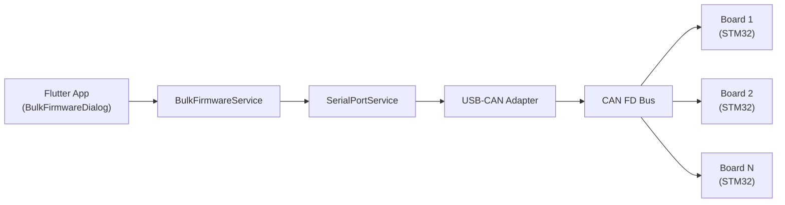
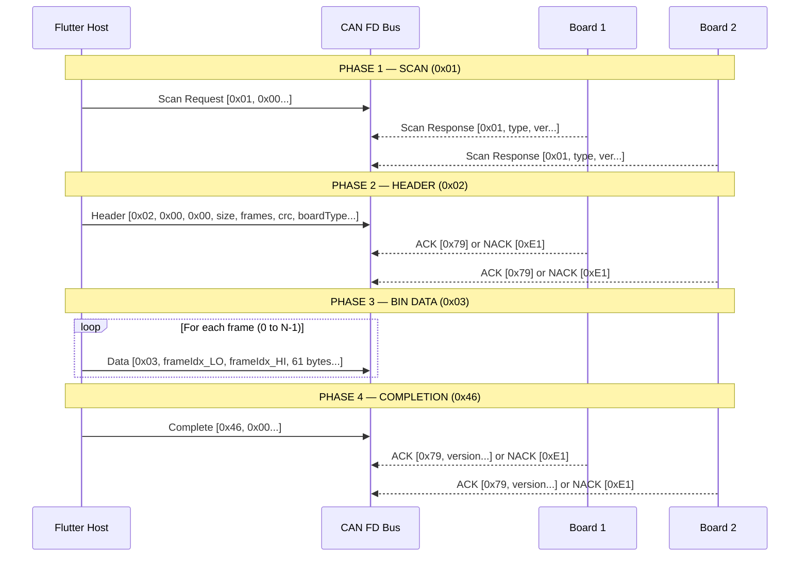
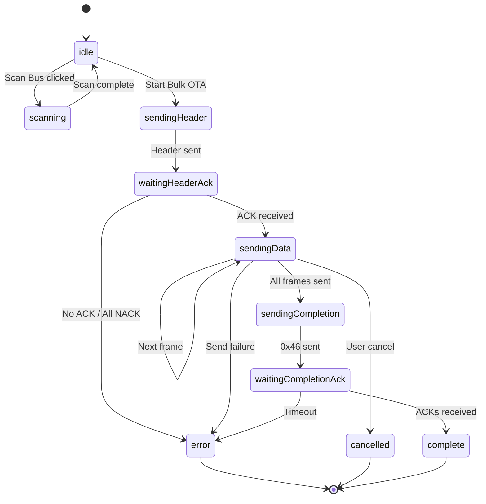

# Bulk CAN FD OTA — Complete Protocol Documentation

## Overview

The Bulk OTA system enables **simultaneous firmware updates** to multiple STM32 boards over **CAN FD** (64-byte frames). It uses a broadcast-style protocol where one host sends firmware to all matching boards at once.

> [!IMPORTANT]
> All multi-byte values use **Little-Endian** byte ordering.
> All frames are exactly **64 bytes** (CAN FD), zero-padded.

---

## Architecture



### Key Files

| File | Purpose |
|------|---------|
| [bulk_firmware_service.dart](file:///d:/1804/RDPMS-COM-READER/serial_monitor/lib/core/services/bulk_firmware_service.dart) | Protocol logic: scan, header, data, completion |
| [bulk_firmware_dialog.dart](file:///d:/1804/RDPMS-COM-READER/serial_monitor/lib/feature/firmware_upload/views/bulk_firmware_dialog.dart) | UI: device grid, file picker, log panel |
| [serial_port_service.dart](file:///d:/1804/RDPMS-COM-READER/serial_monitor/lib/core/services/serial_port_service.dart) | Low-level USB/CAN frame TX/RX |
| [firmware_upload_service.dart](file:///d:/1804/RDPMS-COM-READER/serial_monitor/lib/core/services/firmware_upload_service.dart) | Single-board OTA + CRC-16/MODBUS utility |

---

## Constants

```dart
const int _bulkChunkSize = 61;  // data bytes per frame (bytes 3–63)
const int _frameSize     = 64;  // total CAN FD frame size
const Duration _scanTimeout = Duration(seconds: 3);
const Duration _ackTimeout  = Duration(seconds: 30);
```

---

## Protocol Flow (4 Phases)



---

## Phase 1: Scan Mode (0x01)

**Purpose:** Discover all boards on the CAN bus.

### TX Frame (Host → Bus)

| Byte | Value | Description |
|------|-------|-------------|
| 0 | `0x01` | Mode: Scan |
| 1–63 | `0x00` | Padding |

### RX Response (Board → Host)

| Byte | Value | Description |
|------|-------|-------------|
| 0 | `0x01` | Mode: Scan Response |
| 1 | `0xNN` | Board Type (low byte) |
| 2 | `0xNN` | Board Type (high byte) |
| 3+ | ASCII | Firmware version (null-terminated) |

### Example

```
Host TX:  01 00 00 00 00 00 00 00 ... (64 bytes)

Board RX (CAN ID 0x001):  01 01 00 76 31 2E 33 2E 30 00 ...
                           │  │  │  └─ "v1.3.0" in ASCII
                           │  └──┘  Board Type = 0x0001 (DC High Current)
                           └─ Scan Response
```

### Board Type Registry

| Value | Enum | Label |
|-------|------|-------|
| `0x01` | `dcHighCurrent` | DC High Current |
| `0x02` | `dcLowCurrent` | DC Low Current |
| `0x03` | `dcHighVoltage` | DC High Voltage |
| `0x04` | `dcLowVoltage` | DC Low Voltage |
| `0x05–0x0C` | `reserved05–0C` | Reserved |

### Code Reference

```dart
// bulk_firmware_service.dart — scanBoards() (lines 209–279)
_send64ByteFrame([0x01], canId: txCanId, channel: channel, isExtended: isExtended);
// Listens for 3 seconds, collects all responses with byte[0] == 0x01
```

---

## Phase 2: Header Mode (0x02)

**Purpose:** Tell boards what firmware is coming (size, frame count, CRC, target board type).

### TX Frame Layout (64 bytes)

| Byte(s) | Field | Encoding | Description |
|----------|-------|----------|-------------|
| 0 | Mode | `0x02` | Header mode |
| 1–2 | Frame Index | LE `0x0000` | Always 0 for header |
| 3–4 | File Size | LE uint16 | Total binary file size in bytes |
| 5–6 | Total Frames | LE uint16 | Number of data frames |
| 7–8 | CRC-16 | LE uint16 | CRC-16/MODBUS of entire file |
| 9–10 | Board Type | LE uint16 | Target board type filter |
| 11–63 | Reserved | `0x00` | Zero-padded |

### Example — 10,000 byte firmware for DC High Current board

```
File Size   = 10000 = 0x2710 → bytes: 10 27
Frame Count = ceil(10000 / 61) = 164 = 0x00A4 → bytes: A4 00
CRC-16      = 0x3F8A → bytes: 8A 3F
Board Type  = 0x0001 → bytes: 01 00

TX: 02 00 00 10 27 A4 00 8A 3F 01 00 00 00 00 ... (64 bytes)
     │  └──┘  └──┘  └──┘  └──┘  └──┘
     │  idx=0 size  count  crc   board
     └─ Header Mode
```

### ACK / NACK Responses

| First Byte | Meaning |
|------------|---------|
| `0x79` | ACK — board accepted the header |
| `0xE1` | NACK — board rejected (wrong type, bad CRC, etc.) |

### Timeout Behavior

- Waits up to **30 seconds** total (`_ackTimeout`)
- After first ACK arrives, waits an additional **5 seconds** grace period for more boards
- If **zero** ACKs received → error, upload aborted
- If **all** boards NACK → error, upload aborted
- If **at least one** board ACKs → proceed to data phase

### Code Reference

```dart
// bulk_firmware_service.dart — _buildHeaderPayload() (lines 480–498)
payload[0] = 0x02;                          // Mode
payload[3] = file.fileSize & 0xFF;          // Size LE low
payload[4] = (file.fileSize >> 8) & 0xFF;   // Size LE high
payload[7] = file.fileCrc & 0xFF;           // CRC LE low
payload[8] = (file.fileCrc >> 8) & 0xFF;    // CRC LE high
payload[9] = boardType & 0xFF;              // Board Type LE low
```

---

## Phase 3: Bin Data Mode (0x03)

**Purpose:** Stream the firmware binary, 61 bytes per frame.

### TX Frame Layout (64 bytes)

| Byte(s) | Field | Encoding | Description |
|----------|-------|----------|-------------|
| 0 | Mode | `0x03` | Bin Data mode |
| 1–2 | Frame Index | LE uint16 | 0-based frame number |
| 3–63 | Payload | Raw binary | 61 bytes of firmware data |

### How Chunking Works

```
File: [byte0, byte1, byte2, ... byteN]

Frame 0: bytes[0..60]    → 61 bytes in positions 3–63
Frame 1: bytes[61..121]  → 61 bytes in positions 3–63
Frame 2: bytes[122..182] → 61 bytes in positions 3–63
...
Last frame: remaining bytes, zero-padded to fill 64 bytes
```

### Example — Frame 0 and Frame 1

```
Frame 0 (index=0):
TX: 03 00 00 [61 bytes of firmware starting at offset 0] (64 bytes total)
     │  └──┘
     │  idx=0 (LE)
     └─ Bin Data Mode

Frame 1 (index=1):
TX: 03 01 00 [61 bytes of firmware starting at offset 61] (64 bytes total)
     │  └──┘
     │  idx=1 (LE)
     └─ Bin Data Mode

Frame 256 (index=256 = 0x0100):
TX: 03 00 01 [61 bytes of firmware starting at offset 15616] (64 bytes total)
     │  └──┘
     │  idx=256 → 0x00, 0x01 (LE)
     └─ Bin Data Mode
```

### Timing

- **No per-frame ACK** — data is streamed continuously (fire-and-forget)
- `interFrameDelayMs` configurable (default: 0ms, with 1ms minimum yield for UI)
- Cancellable at any frame via `_cancelled` flag

### Code Reference

```dart
// bulk_firmware_service.dart — _buildDataPayload() (lines 501–515)
payload[0] = 0x03;                             // Mode
payload[1] = frameIndex & 0xFF;                // Frame index LE low
payload[2] = (frameIndex >> 8) & 0xFF;         // Frame index LE high
// Copy 61 bytes of firmware data into payload[3..63]
final dataStart = frameIndex * 61;             // _bulkChunkSize = 61
```

---

## Phase 4: Completion Signal (0x46)

**Purpose:** Tell all boards that the transfer is finished so they can verify CRC and apply the firmware.

### TX Frame

| Byte | Value | Description |
|------|-------|-------------|
| 0 | `0x46` | Completion signal |
| 1–63 | `0x00` | Padding |

### RX Response (per board)

| Byte | Value | Description |
|------|-------|-------------|
| 0 | `0x79` / `0xE1` | ACK (success) / NACK (CRC fail, write error) |
| 1+ | ASCII | New firmware version string (null-terminated) |

### Example

```
Host TX: 46 00 00 00 00 00 00 00 ... (64 bytes)

Board 0x001 RX: 79 76 31 2E 34 2E 30 00 ...  → ACK + "v1.4.0"
Board 0x002 RX: E1 00 00 00 00 00 00 00 ...  → NACK (update failed)
```

### Timeout: Same as header — 30s max, 5s grace after first response.

---

## Complete End-to-End Example

### Scenario: Update 3 boards with a 183-byte firmware file

```
File size: 183 bytes
Chunk size: 61 bytes
Frame count: ceil(183/61) = 3 frames
CRC-16: 0xAB12
Target: DC High Current (0x01)
```

**Step 1 — Scan:**
```
TX: 01 00 00 ... (64 bytes)
RX from 0x001: 01 01 00 76 31 2E 30 00 ...  → Type=0x01, "v1.0"
RX from 0x002: 01 01 00 76 31 2E 30 00 ...  → Type=0x01, "v1.0"
RX from 0x003: 01 02 00 76 31 2E 30 00 ...  → Type=0x02 (different type)
→ 3 boards discovered
```

**Step 2 — Header:**
```
TX: 02 00 00 B7 00 03 00 12 AB 01 00 00 ...
     │        └──┘  └──┘  └──┘  └──┘
     │       sz=183 cnt=3 crc   type=0x01
RX from 0x001: 79 ...  → ACK ✓ (type matches)
RX from 0x002: 79 ...  → ACK ✓ (type matches)
RX from 0x003: E1 ...  → NACK ✗ (type=0x02 ≠ 0x01, board ignores)
```

**Step 3 — Data (3 frames):**
```
TX Frame 0: 03 00 00 [bytes 0–60]     (61 bytes firmware data)
TX Frame 1: 03 01 00 [bytes 61–121]   (61 bytes firmware data)
TX Frame 2: 03 02 00 [bytes 122–182]  (61 bytes, zero-padded)
```

**Step 4 — Completion:**
```
TX: 46 00 00 ... (64 bytes)
RX from 0x001: 79 76 31 2E 31 00 ...  → ACK + "v1.1" ✓
RX from 0x002: 79 76 31 2E 31 00 ...  → ACK + "v1.1" ✓
→ 2 boards updated successfully!
```

---

## Upload State Machine



---

## Console Suppression

During OTA, normal CAN RX/TX console logging is suppressed to prevent flooding:

```dart
void _suppressConsoleLogging() {
    _savedRxCallback = _serialService.onCanFrameRx;   // save
    _savedTxCallback = _serialService.onCanFrameTx;
    _serialService.onCanFrameTx = null;                // suppress TX logging
    // RX callback is overridden to listen for ACKs
}

void _restoreConsoleLogging() {
    _serialService.onCanFrameRx = _savedRxCallback;    // restore
    _serialService.onCanFrameTx = _savedTxCallback;
}
```

> [!NOTE]
> Only TX logging is suppressed. RX callback is **replaced** with the ACK listener during header and completion phases. It's fully restored in the `finally` block.

---

## CRC-16/MODBUS

Used for file integrity verification. Computed over the **entire firmware binary**.

```dart
// firmware_upload_service.dart — crc16Modbus() (lines 9–22)
int crc16Modbus(List<int> data) {
    int crc = 0xFFFF;
    for (int byte in data) {
        crc ^= byte & 0xFF;
        for (int i = 0; i < 8; i++) {
            if ((crc & 0x0001) != 0) {
                crc = (crc >> 1) ^ 0xA001;
            } else {
                crc = crc >> 1;
            }
        }
    }
    return crc & 0xFFFF;
}
```

---

## UI Dialog Features

The [BulkFirmwareDialog](file:///d:/1804/RDPMS-COM-READER/serial_monitor/lib/feature/firmware_upload/views/bulk_firmware_dialog.dart) provides:

1. **File Picker** — Select `.bin` firmware file (PowerShell native dialog)
2. **Board Type Selector** — Dropdown to filter target boards
3. **Scan Bus Button** — Sends 0x01 scan, displays discovered devices in a grid
4. **Device Grid** — Shows each board's CAN ID, type, version, and OTA status with color-coded icons
5. **Transfer Log** — Real-time protocol log with timestamps (TX=blue, RX=green, Error=red)
6. **Progress Bar** — Linear progress indicator
7. **Mock Mode** — Toggle to simulate the full OTA flow without hardware

---

## Summary of Protocol Byte Codes

| Code | Direction | Meaning |
|------|-----------|---------|
| `0x01` | TX & RX | Scan request / Scan response |
| `0x02` | TX | Header (file metadata) |
| `0x03` | TX | Bin data frame |
| `0x46` | TX | Completion signal |
| `0x79` | RX | ACK (success) |
| `0xE1` | RX | NACK (error/rejection) |
